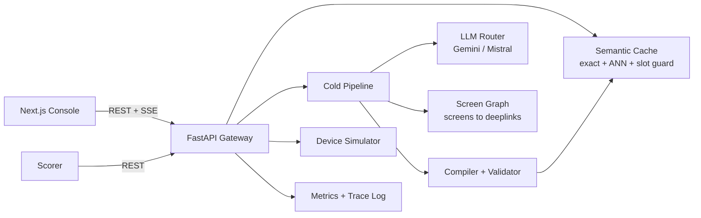
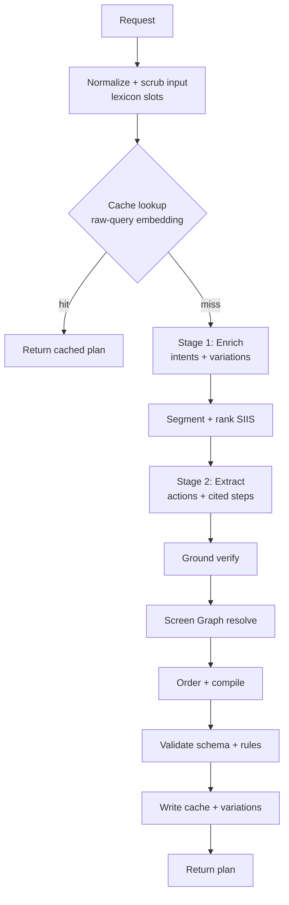
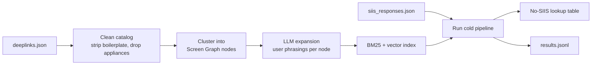
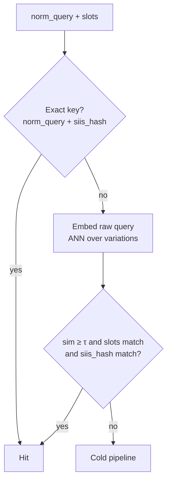
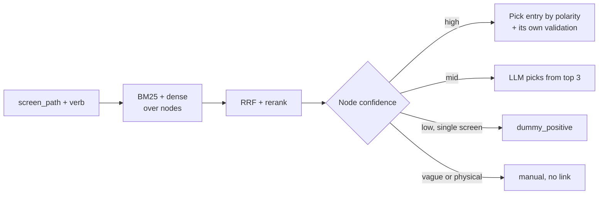
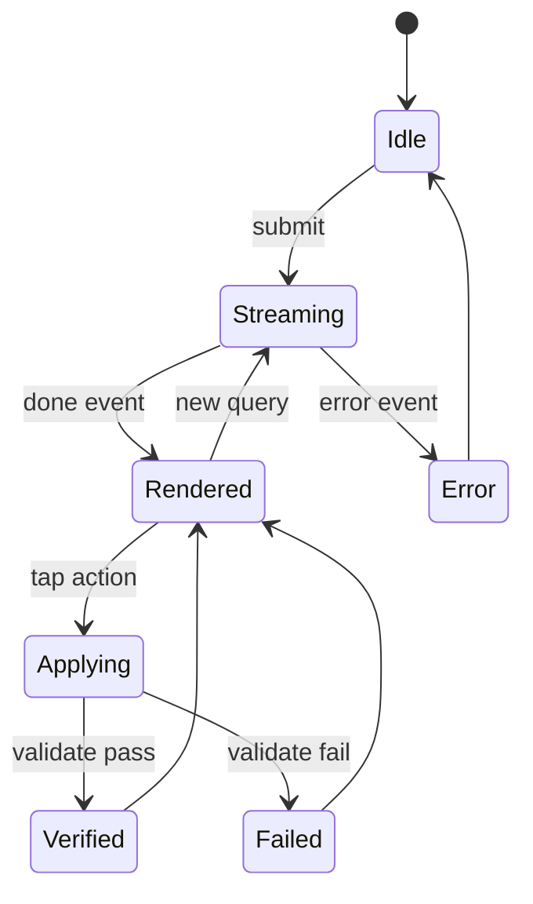
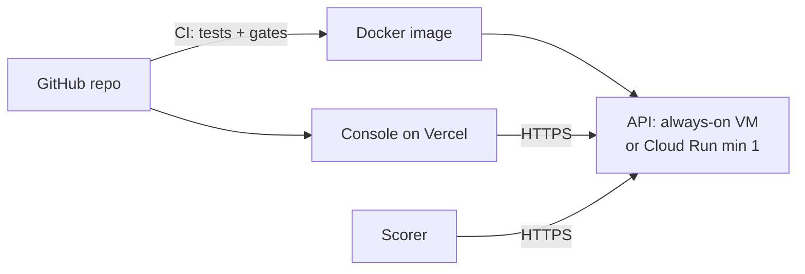

# Smart Guided Troubleshooting Engine — Architecture & System Design

Exported from the team design doc (2026-09-18; PDF copy in this folder). The design is kept as
written; [What the submission actually runs](#what-the-submission-actually-runs) at the end lists
every place the tagged build differs from it and why. Where the two disagree, that section and the
code win.

## Summary

We build a single FastAPI service where the LLM extracts meaning and deterministic code produces the
answer. Every rule the scorer checks is enforced in code, so gate compliance holds by construction,
not by prompting.

The cold path runs two small LLM calls (Gemini Flash-class, Mistral as fallback), a grounding
verifier, a Screen Graph resolver for deeplinks, and a compiler. The hot path embeds the normalized
raw query and searches stored query variations, answering in under 50 ms with no LLM call. A Next.js
console streams the pipeline live and renders the plan on a phone mockup for the demo.

### Design principles

1. **LLM proposes, code disposes.** The model never writes final JSON strings the scorer checks; code does.
2. **Every step is traceable.** Each step cites SIIS sentence ids; untraceable steps are dropped. Grounding coverage is a headline metric.
3. **Retrieval, not generation, for deeplinks.** URIs come only from the catalog, through a reusable Screen Graph.
4. **Fast and safe cache.** The hot path never calls an LLM; near-miss complaints are blocked by a deterministic slot guard.
5. **Honest measurement.** No pre-warming of SIIS requests; dummy deeplink rate and false-hit rate are reported, not hidden.
6. **Determinism from code.** Identical inputs give identical outputs because of the cache and the compiler, not model temperature.

## Requirements

### Functional

1. `POST /v1/troubleshoot` takes `query` plus optional `siis_response` and returns a schema-valid `ContextDeeplinkResponse`.
2. `GET /health` returns `{"status":"ok"}` only when indexes, Screen Graph, no-SIIS lookup table and LLM clients are loaded.
3. Extract Goal, Actions and StepGroups only from SIIS text; rephrasing allowed, invention not.
4. Map each screen-level action to a Screen Graph node, then to a catalog deeplink with correct polarity and its own validation object.
5. Order actions by disruption and prerequisites; critical actions last, prerequisites (backup, safe mode) before what depends on them.
6. Split multi-intent complaints into one Goal each, with no action repeated across Goals.
7. Serve repeat and paraphrased queries from a semantic cache with no LLM call on the hot path.
8. Produce `results.jsonl` with 8–10 lexically diverse query variations per query.
9. Return a partial plan whenever any step survives grounding; return `no_match` only when none do.
10. Without `siis_response`, answer from the pre-warmed no-SIIS lookup table; if nothing matches, return empty `contexts` with `no_siis_context`.
11. Demo extras: live pipeline stream, validation loop against a simulated device, metrics dashboard, Screen Graph explorer.

### Non-functional targets

| Metric | Official target | Our internal target |
| --- | --- | --- |
| Schema-valid responses | ≥ 90% (gate G4) | 100% |
| URL leaks | 0 (gate G5) | 0, checked on every response |
| Query coverage | ≥ 95% (gate G3) | 100% |
| Cache hit p95 (repeat) | ≤ 300 ms, ≥ 90% hit | ≤ 50 ms server-side, 100% hit |
| Paraphrase hit rate | ≥ 80% | ≥ 90%, with false-hit rate ≤ 2% |
| Cold path p95 | ≤ 8 s | ≤ 4 s, genuinely cold |
| Deeplink catalog validity | 100% | 100% |
| Auto actions with deeplink | ≥ 90% | 100% |
| Dummy deeplink rate | not stated | Reported in metrics.md; as low as the catalog allows |
| Step grounding coverage | not stated | 100% of emitted steps cite a source |
| Deeplink precision@1 | not stated | ≥ 85% on our gold set |
| Cost per cold query | tracked | ≤ $0.002 |
| Uptime in judging window | must be reachable | always-on, no scale-to-zero |

### Constraints and assumptions

- Python 3.10+, Pydantic v2, no auth on endpoints, bring-our-own LLM keys.
- The scorer's first call on a query is cold by design (FAQ); we never pre-compute answers for SIIS requests.
- Hidden tests cover Battery, Camera and Performance, not just the Display cases in the kit.
- Hidden tests always include an SIIS payload and must return non-empty responses (A4).
- The catalog has gaps: no safe mode, clear cache or Smart Switch entries, so some settings steps will need `dummy_positive`.
- Judges call a public URL; we host it ourselves for the whole evaluation window.
- Gemini or Mistral usage earns bonus points, so both are in the stack.

## High-level design

Three parts: an offline build that prepares indexes and a warm cache, an online API with a hot and a
cold path, and a demo console. They share one container image for the API, plus a separate web
frontend.

### Components



The scorer and the console hit the same engine. The console additionally uses a streaming endpoint
and the device simulator.

### Request flow



The hot path needs no LLM: normalize, extract slots with a lexicon, embed the raw query, search
stored variations — around 20–40 ms on CPU. The cold path makes two LLM calls and runs everything
else locally, around 2–4 s. After a cold run all 8–10 query variations are stored as extra vectors,
so later paraphrases hit.

### Offline build



The Screen Graph, indexes and the no-SIIS lookup table are baked into the Docker image. The SIIS
cache starts empty, so the scorer's first call on each query is genuinely cold, as the FAQ expects.

## Architecture decisions (ADRs)

Deciders: all three members.

### ADR-001: LLM extracts, code compiles

**Context.** The scorer checks exact formats (goal template, 2–3 word title, 5–7 word description,
zero URLs). The spec itself warns that prompt-only constraints are unreliable.

**Decision.** The LLM returns semantic fields only (steps, source ids, screen path, intent verb,
category hint). A deterministic compiler builds every scored string and validates the result.

| Option | Complexity | Rule compliance | Handles unseen | Cost/query |
| --- | --- | --- | --- | --- |
| A. End-to-end LLM JSON + retry | Low | ~85–95%, variable | Good | Higher (retries) |
| **B. LLM extracts, code compiles** | Medium | 100% by construction | Good | Low |
| C. Pure rules parser, no LLM | Medium | 100% | Poor on messy SIIS | ~$0 |

**Trade-off.** B costs more engineering than A but removes the main source of lost points. C fails on
unseen, loosely structured articles. **Consequences.** Easier: gates, determinism, debugging. Harder:
we own a template and repair layer.

### ADR-002: Gemini Flash-class primary, Mistral fallback

**Context.** Any LLM is allowed; Gemini and Mistral earn bonus points. Cold p95 must stay under 8 s.

**Decision.** The latest stable Gemini Flash-class model with JSON-schema output as primary; a
Mistral small model as automatic fallback on timeout (3 s) or error. Temperature 0.

| Option | Latency | Cost | Bonus | Risk |
| --- | --- | --- | --- | --- |
| **A. Gemini primary + Mistral fallback** | Low | Low | Both | Two SDKs |
| B. OpenAI or Anthropic only | Low | Medium | None | Single provider |
| C. Local open model | High on CPU | GPU needed | Partial | Slow cold path |

**Consequences.** Easier: resilience during judging, bonus points. Harder: two prompt dialects, so
prompts live in versioned files with a per-provider test.

### ADR-003: Hybrid retrieval for deeplinks, not LLM mapping

**Context.** 578 masked URIs must be matched on descriptions. Hallucinated or altered URIs are
forbidden. Production target is 10k+ scenarios.

**Decision.** Steps map to a Screen Graph node first (ADR-009). Retrieval runs over nodes: BM25 plus
dense, fused with reciprocal rank fusion, then a cross-encoder rerank, then a polarity filter. The
LLM only breaks ties below a confidence threshold, choosing among retrieved ids.

| Option | Accuracy | Hallucination risk | Latency | Scales to 10k |
| --- | --- | --- | --- | --- |
| A. Full LLM mapping (catalog in prompt) | Good | Medium | High | Poor |
| **B. Hybrid retrieval + rerank** | Good–high | None | ~30 ms | Yes |
| C. Pure keyword rules | Medium | None | ~1 ms | Brittle |

**Consequences.** Easier: exact-URI guarantee, reuse across scenarios. Harder: a gold set is needed
to tune thresholds. All three variants run in the ablation for metrics.md.

### ADR-004: Two-tier semantic cache with a slot guard

**Context.** Paraphrases must hit (≥ 80%), and near-miss complaints must not. The same query with a
different SIIS must not return a stale plan.

**Decision.** Tier 0 is an exact hash of the normalized query plus SIIS hash. Tier 1 embeds the
normalized raw query (never an LLM output) and searches all stored query variations. A hit needs
similarity ≥ τ, matching lexicon slots and a matching SIIS hash. No LLM call happens before a hit or
miss is decided.

| Option | Paraphrase hits | False hits | Latency |
| --- | --- | --- | --- |
| A. Exact string key | Near 0% | 0% | < 1 ms |
| B. Embedding only | High | Unmeasured, risky | ~20 ms |
| **C. Exact + embedding + slot guard** | High | Measured, low | ~20 ms |

**Consequences.** Easier: a real sub-50 ms hot path and a demo moment that proves safety. Harder: τ
calibration and a hand-built slot lexicon. Paraphrase recall depends on the stored variations, so
variation quality directly drives A3.

### ADR-005: Local ONNX embeddings, in-memory vector index

**Context.** The hot path must stay under 300 ms, ideally far under. The corpus is small (578
entries plus cache).

**Decision.** A small sentence-embedding model run with ONNX on CPU (via fastembed); FAISS flat or a
plain NumPy index in process; no external vector database.

| Option | Hot latency | Cost | Ops burden |
| --- | --- | --- | --- |
| **A. Local ONNX + in-memory index** | ~10–20 ms | $0 | None |
| B. Embedding API | 100–400 ms | Small | Network risk |
| C. Managed vector DB | +50–150 ms | Small | Extra service |

**Consequences.** Revisit at 10k scenarios with many cache entries: move to HNSW or a managed store.

### ADR-006: Where operational metadata goes

**Context.** The spec wants latency, cache flag and cost exposed. The FAQ says the endpoint returns
`ContextDeeplinkResponse`.

**Decision.** The body is `{"contexts": [...], "meta": {...}}`; it validates because Pydantic ignores
extra keys by default. The same values also go in `X-Latency-Ms`, `X-Cache-Hit` and `X-Cost-Usd`
headers. A config flag strips `meta` if the organisers use strict validation. In `results.jsonl`,
`meta` sits beside `response`, as in Appendix B.

### ADR-007: FastAPI in one always-on container

**Context.** Judges hit a live URL; a sleeping instance kills cold-start and latency scores.

**Decision.** FastAPI on uvicorn, one Docker image, deployed on a small always-on VM or Cloud Run
with min instances set to 1. The same image runs locally with `docker compose up`.

| Option | Cold-start risk | Cost | Effort |
| --- | --- | --- | --- |
| **A. Always-on VM / min-instance 1** | None | Low monthly | Low |
| B. Serverless scale-to-zero | High | Near 0 | Low |
| C. Kubernetes | None | High | High |

### ADR-008: Next.js console with a separate SSE stream

**Context.** The video depends on a polished UI that shows the pipeline live, without changing the
scored contract.

**Decision.** Next.js with Tailwind and Framer Motion, calling `POST /v1/troubleshoot/stream`, which
emits one Server-Sent Event per stage and the final plan. The scored endpoint stays plain JSON.

| Option | Visual quality | Effort | Fits video |
| --- | --- | --- | --- |
| **A. Next.js + SSE** | High | Medium | Yes |
| B. Streamlit or Gradio | Low–medium | Low | Looks like every other team |
| C. Swagger UI only | Low | None | No |

### ADR-009: Build a real Screen Graph now

**Context.** Catalog entries repeat the same screen (on/off/open variants share one validation key).
Per-request retrieval over 578 raw entries confuses parent menus with leaf screens. The jury asks
whether this can scale to 10k+ scenarios.

**Decision.** Offline, cluster the catalog into canonical screen nodes. Each node holds its path,
synonyms, entries by polarity, and validation objects. At request time a step maps to a node, then
the node yields the right entry for the step's verb.

| Option | Accuracy | Reuse across scenarios | Effort |
| --- | --- | --- | --- |
| A. Retrieval over raw entries | Medium | None | Low |
| **B. Screen Graph nodes + retrieval** | High | Full | Medium |
| C. Hand-written screen map | High | Full | High, brittle |

**Consequences.** Easier: polarity handling, leaf-vs-parent choice, the worklet story, and a live
explorer in the console. Harder: one offline clustering pass, reviewed by hand.

## Component deep dive

### C1. Input normalizer, scrubber and slot extractor

Runs before anything else, with no LLM. It fixes whitespace, strips list numbering and quote marks,
and lowercases a copy for keys. It removes URLs, emails and domains from the SIIS text, so the LLM
never sees `kidshome.pin@samsung.com`. A lexicon and regex extractor pulls slots: `component`
(screen, battery, camera, app, network…) and `symptom` (black, cracked, flicker, drain, overheating,
slow…). Output: `norm_query`, `slots`, `siis_clean`, `siis_hash`.

### C2. Semantic cache (hot path)



- The embedding input is the normalized raw query, never an LLM output.
- Each solved plan is stored under its original query plus all 8–10 variations, so a paraphrase matches one of ~10 phrasings.
- The slot guard compares lexicon slots; if either side has a slot the other contradicts (black vs cracked), it is a miss.
- SIIS requests start with an empty cache. Only the no-SIIS lookup table is pre-warmed from the kit.
- Single-flight lock per key, so concurrent identical cold requests compute once.
- Every hit still passes the final URL scrub and schema check.
- Storage: in-memory dict and index, persisted to SQLite across restarts.

### C3. Stage 1 — Enrichment (LLM call A)

One structured call returns: canonical technical query, 1–3 intents, domain (Battery / Display /
Camera / Performance / Other), a proposed 2–3 word title per intent, and 12 candidate query
variations across five registers (formal, casual, keyword-only, frustrated, typo-inclusive).

Code filters variations for lexical diversity, which is what the scorer measures: it drops any
variation with token Jaccard ≥ 0.6 against the original query or an already-kept variation, then
keeps the 8–10 most distinct. An embedding check (cosine ≥ 0.6 to the original) removes variations
that drifted off-meaning.

### C4. SIIS segmenter and relevance ranker

Splits the article into sections on `#` headers, then into numbered sentences `S1…Sn`. Each section is
embedded and scored against each intent. Sections below a relevance floor are marked irrelevant and
shown greyed in the demo.

### C5. Stage 2 — Extraction (LLM call B)

Input: intents plus the relevant, numbered sentences. Output per intent: a topic phrase and a list of
actions. Each action has `steps[]` (each step with `src: [sentence ids]`), `screen_path` (for example
`Settings > Display > Navigation bar`), `intent_verb` (open, enable, disable, set, check, restart,
reset, visit), a draft `description`, and a category hint. Output is forced with a JSON schema. The
model is told to group steps on the same screen into one action.

### C6. Grounding verifier

Two levels, both deterministic.

- **Step level.** Embedding similarity to the cited sentences is the primary test (starting τ = 0.75). The step must also share at least one content term with its source — the screen name, setting name or key noun — which catches plausible but unsupported steps that embeddings alone would pass.
- **Action level.** The action's screen or setting must appear in its cited section.

Failing steps are dropped; an action with no steps left is dropped. Grounding coverage (kept steps
with a valid source ÷ emitted steps) is a headline metric.

### C7. Screen Graph and deeplink resolver

**Offline build.**

- Strip boilerplate from descriptions ("Opens the … page in device Settings on the device") before indexing.
- Remove true appliance entries after a manual check. Keep TV and Smart View entries (kit articles cover screen mirroring) and the three Diagnose entries (DL-0474, DL-0475, DL-0476).
- Read polarity from `originalType` and, when that is null, from `message` (DL-0294 "Offurl", DL-0295 "Onurl").
- Cluster entries into screen nodes: entries sharing a validation deeplink, or near-identical cleaned descriptions, form one node. Each node stores its path, synonyms, entries by polarity, and each entry's own validation object.
- Index nodes with BM25 (weighting `message` and `qna_description` above `description`) and dense embeddings, plus 5 LLM-written user phrasings per node.

**At request time.**



**Tiered link decision.**

| Situation | Category | Deeplink |
| --- | --- | --- |
| Node match above threshold | auto | Catalog URI of the entry matching the verb; its own validation copied verbatim |
| Clearly one Settings screen, no catalog node | auto | `bixby://dummy_positive`, description naming the exact screen |
| Multi-screen, app-internal or vague step | manual | None |
| Physical step (charge, clean, inspect, service) | manual | None |

The dummy rate is reported in metrics.md.

### C8. Categorizer

Code overrides the LLM hint with keyword rules. Restart, force restart, safe mode, software update
and factory reset are always `critical`. Physical and external steps are always `manual`. An action is
`auto` only through the tiered link decision above.

### C9. Orderer

Ordering is by disruption rank, then prerequisites, then SIIS order.

| Rank | Kind of action | Examples |
| --- | --- | --- |
| 0 | Quick physical checks and settings screens | Charge 30 min, inspect for damage, toggle a setting |
| 1 | App-level fixes | Clear cache, update or reinstall an app |
| 2 | Connectivity and account | Reset network settings, re-sign in |
| 3 | Diagnostics | Samsung Members diagnostics |
| 4 | External help | Visit service centre, contact support |
| 5 | Critical | Restart < safe mode < software update < factory reset |

A small dependency table then applies a topological sort: backup before factory reset, safe mode
before uninstalling apps in safe mode, charging before force restart on a dead screen. SIIS order
breaks remaining ties. Critical actions stay last unless a dependency requires otherwise; external
help moves to the end only if the organisers confirm.

### C10. Compiler

Builds every scored string deterministically.

| Field | How it is produced |
| --- | --- |
| goal | Topic with any trailing "Troubleshooting" or "Configuration" stripped, then `Follow these steps to perform this {Topic} Troubleshooting.` (or `Configuration.`) |
| title | LLM-proposed 2–3 words, validated; trimmed only if over length; sentence case |
| actionName | Title Case, deduplicated; same-screen actions merged |
| description | LLM draft; a trimmer enforces "It will" + total 5–7 words including "It will", dropping filler words first |
| steps | Imperative, trailing period, numbering stripped |
| score | 0.4 section relevance + 0.3 grounding coverage + 0.3 link coverage, clamped 0–1 |

Link coverage counts only actions that should have a link: real catalog links score 1.0, dummy links
0.5, and manual or physical actions are excluded, so a correct, mostly manual cracked-screen plan is
not penalised. A final pass runs the URL regex over every string and validates with the official
`schema.py`. Any failure triggers one repair cycle, then drops the offending action.

### C11. Multi-intent handling

Stage 1 splits the complaint into intents, each grounded only in sections relevant to it. Because
every request has one article, the same action can surface under several intents. Each duplicate
action (same screen and verb, or near-identical steps) is kept only in the Goal where its relevance is
highest. A Goal left with no actions is dropped. Goals are sorted by relevance.

### C12. Validation loop and device simulator

A simulator holds a fake device state built from the catalog's validation keys.

- **Full validation** (138 entries with key, condition and value). Applying the action sets the value; validation evaluates the condition and shows "Verified".
- **Other entries.** The pass condition is "screen opened", labelled as such in the UI.

The demo uses toggle entries for the headline moment and always labels the device as simulated.

## API contracts and data models

No auth on any endpoint. CORS allows the console origin. Request body limit 256 KB.

| Method + path | Purpose | Used by |
| --- | --- | --- |
| `POST /v1/troubleshoot` | Scored endpoint; returns `ContextDeeplinkResponse` (+ `meta`) | Scorer, console |
| `GET /health` | `{"status":"ok"}` once cache, index and LLM clients are ready; 503 before | Scorer |
| `POST /v1/troubleshoot/stream` | Same engine, SSE events per stage, final event = plan | Console |
| `POST /v1/device/apply` | Apply an auto action to the simulated device | Console |
| `POST /v1/device/validate` | Evaluate a validation deeplink against device state | Console |
| `GET /v1/metrics` | Live counters: p50/p95, hit rate, cost, gate status | Console, eval |
| `GET /v1/trace/{id}` | Full internal trace: sources, retrieval candidates, scores | Console, debugging |

**Request.** `siis_response` accepts the object form from the kit and a plain string, per the spec PDF.

```json
{
  "query": "phone swipe gestures wrong direction after app install",
  "siis_response": { "title": "...", "content": "..." }
}
```

**Response.** The official schema plus an ignorable `meta` block (ADR-006):

```json
{
  "contexts": [ { "goal": "...", "title": "...", "score": 0.91, "actions": [ "..." ] } ],
  "meta": { "latency_ms": 212, "cache_hit": true, "cache_tier": "semantic",
            "model": "gemini-flash", "cost_usd": 0.0, "trace_id": "t_8f2c", "fallback": null }
}
```

`fallback` is `null` when a plan is returned, including partial plans. It is `no_match` only when no
step survives grounding, and `no_siis_context` when there is no SIIS and no lookup-table match;
`contexts` is then empty.

**SSE events (console only).** `cache → enrich → segment → extract → ground → resolve → compile →
done`. Each event carries `{stage, ms, summary, detail}`; `done` carries the full response. On a cache
hit the stream jumps from `cache` to `done`.

**Internal models** (not exposed to the scorer; only the compiler output reaches the official schema):

| Model | Key fields |
| --- | --- |
| Slots | component, symptom (from the lexicon, no LLM) |
| Intent | text, domain, proposed title, relevance |
| SiisSentence | id, section, text, relevance |
| DraftStep | text, src_ids, grounded, grounding_score |
| DraftAction | steps, screen_path, intent_verb, category, disruption_rank, depends_on |
| ScreenNode | node_id, path, synonyms, entries by polarity, validation per entry |
| LinkDecision | node_id, entry_id, confidence, tier (catalog / dummy / manual) |
| CacheEntry | key, siis_hash, query_vectors (original + variations), slots, plan, created_at, hits |
| Trace | trace_id, stage timings, tokens in/out, cost, all of the above |

## Frontend console

A Next.js app with three routes, designed shot by shot from the video storyboard. Stack: Next.js (App
Router), TypeScript, Tailwind, Framer Motion, shadcn/ui, Recharts. It deploys separately from the API
and reads the API URL from an env var.

| Route | What it shows | Video scene |
| --- | --- | --- |
| `/` Console | Input pane, live pipeline trace, phone mockup, JSON toggle | Hook, cold run, cache, grounding, multi-intent, unseen |
| `/metrics` | Gate status, latency percentiles, hit and false-hit rate, precision@1, cost, ablation chart | Under the hood |
| `/architecture` | Animated system diagram and the Screen Graph explorer | Scale / worklet |

- **Left: input.** Complaint box, preset chips (kit scenarios, near-miss pair, battery and camera tests), collapsible SIIS viewer.
- **Centre: pipeline trace.** One row per SSE stage with its real time in ms; rows expand to show intents, relevant sections, retrieval candidates with scores.
- **Right: phone mockup.** One UI-inspired: goal header, action cards with category badges, steps, one-tap button, verified tick after validation.
- **Grounding hover.** Hovering a step highlights its source sentences in the SIIS viewer; irrelevant sections stay greyed.
- **JSON toggle.** Raw response with badges: schema-valid, 0 URL leaks, cache tier.



Design system: soft neutral background, one accent colour, large rounded cards, light and dark mode.
The same tokens feed the deck and video captions. No Samsung logos or brand assets.

## Reliability, errors and deployment

The scored endpoint always returns HTTP 200 with a schema-valid body, even when something inside
fails. Errors degrade the answer, never the contract.

| Failure | Detection | Response |
| --- | --- | --- |
| Primary LLM slow or down | 3 s timeout, 5xx, rate limit | Retry once on the fallback; `meta.model` records which |
| Enrichment fails on both LLMs | Second failure | The normalized query as the only intent; variations from templates |
| Extraction fails or exceeds its budget | Timeout or invalid JSON after one repair | Rules-only steps: imperative sentences from the top-ranked sections, score capped at 0.5 |
| Retrieval exceeds its budget | 500 ms guard | Mark those actions manual with no deeplink |
| Compiled plan fails validation | Pydantic or rule check | Drop the offending action, re-validate; never return invalid JSON |
| No step survives grounding | Zero kept steps | Empty `contexts`, `fallback: no_match` |
| No SIIS, no lookup match | Miss without SIIS | Empty `contexts`, `fallback: no_siis_context` |
| Malformed request | FastAPI validation | 422 with a clear message (not scored) |

Each stage has its own time budget (enrich 2.5 s, extract 3.5 s, retrieval 0.5 s), so a slow stage
triggers its own degrade path well before the 8 s limit. The URL scrub and schema check run on every
response, including cache hits, as the last step before sending.

**Determinism.** Temperature 0 is not bitwise deterministic on hosted models, so we do not rely on
it. The cache returns the identical plan for identical or matching inputs, and the compiler turns the
LLM's semantic output into strings by fixed rules. Prompt version is part of the cache key, so a
prompt change never serves an outdated plan.



- One image with model weights, Screen Graph, indexes and the no-SIIS lookup table baked in; boot to healthy in under 20 s.
- `/health` returns 503 until the Screen Graph, indexes, lookup table and LLM clients are all loaded.
- The SIIS cache is not baked in; it fills from real traffic and persists in SQLite across restarts.
- 2 vCPU, 4 GB RAM is enough: ONNX embeddings and the cross-encoder are small. Uvicorn with 2 workers sharing the SQLite cache.
- Keys come only from environment variables; `.env.example` is committed, `.env` never is.
- An external uptime check pings `/health` every minute during the judging window.
- `docker compose up` runs the stack locally with one command.

## Evaluation harness and observability

We build our own copy of the scorer first, so every change is measured against the real gates before
it merges.

| Set | Size | Built how | Measures |
| --- | --- | --- | --- |
| Kit scenarios | 20 | From `siis_responses.json` | Gates, format, coverage |
| Held-out paraphrases | ~200 | Written by a different model plus teammates, never used to warm the cache | Paraphrase hit rate |
| Near-miss pairs | ~60 | Same component, different symptom (black vs cracked, drain vs overheating) | False-hit rate, τ tuning |
| Step→deeplink gold | ~100 pairs | Hand-labelled by the team | Precision@1, parent-menu errors |
| Unseen domains | ~15 | Battery, Camera, Performance complaints with articles we write | Generalization (A4) |
| Adversarial | ~15 | Typos, Hinglish, three-in-one complaints, articles containing URLs | Robustness, zero leaks |

**Checks.**

- **Gate replica.** G2 health, G3 coverage, G4 schema validity, G5 URL leaks, plus A1–A5 from the FAQ. Each query is sent twice with an empty SIIS cache, matching the scorer's cold-then-hit pattern.
- **Step accuracy (0–3).** LLM-as-judge with a written rubric for completeness, correctness and order; 20% spot-checked by hand.
- **Deeplink relevance (0–2).** Exact screen = 2, parent menu = 1, wrong = 0, against the gold set.
- **Grounding coverage**, **dummy rate** (by catalog gap), **variation diversity** (mean pairwise token Jaccard), **latency** (N ≥ 30 per path, p50/p95), **cost** (tokens × price table in config).
- **Ablation.** Full LLM mapping vs raw-entry retrieval vs Screen Graph retrieval vs rules-only, on the same gold set.

CI (GitHub Actions) runs unit tests and the gate replica on every pull request; a nightly job runs the
full suite and regenerates metrics.md and results.jsonl.

**Observability.** Structured JSON logs, one line per request, with trace id, stage timings, cache
tier, model, tokens and cost. An in-memory rolling window (last 1,000 requests) backs `/v1/metrics`;
full traces for the last 200 requests back `/v1/trace/{id}`.

## Repo structure and ownership

One monorepo, so the tagged commit `PRISM_GENAI_HACKATHON_Y2026` holds code, deck, video link and docs
together. The lane split lives in [TEAM.md](TEAM.md).

| Owner | Area | In the video |
| --- | --- | --- |
| Vishaal (lead) | Pipeline, compiler, orderer, LLM router, grounding | Cold run, grounding, multi-intent |
| Karur | Screen Graph, retrieval, cache, performance, deployment | Cache scene, metrics, Screen Graph explorer |
| Nikhil | Console, design system, deck, video edit, evaluation | Hook, UI, final cut |
| Shared | Eval sets, gold labels, slot lexicon, dependency table | Results numbers |

## Risks, open questions and scaling

| Risk | Impact | Mitigation |
| --- | --- | --- |
| Kit SIIS articles often mismatch the query | Plans look off-topic | Section relevance ranking; partial plan with an honest lower score |
| Catalog gaps (no safe mode, clear cache, Smart Switch) | Many dummy links look like weak mapping | Tiered link decision; dummy rate reported openly |
| Cache false hit on near-miss complaints | Wrong fix served fast | Lexicon slot guard, SIIS hash check, τ tuned on the near-miss set |
| Paraphrase hit rate below 80% | A3 points lost | Store all variations as vectors; tune τ on held-out paraphrases |
| LLM rate limits or outage in judging | Cold path fails | Fallback model, per-stage degrade paths |
| Host sleeps or crashes | Latency block and gates lost | Always-on host, health-gated boot, uptime alerts |
| Hidden tests in unseen domains | Generalization points lost | Domain-agnostic prompts; Diagnose entries kept; own Battery, Camera, Performance tests |
| Over-trimmed descriptions read robotic | Lower manual review | LLM draft first, trimmer only removes filler |

**Open questions** (emailed to prism@samsung.com). Settled by us: loose SIIS returns a partial plan
(A4 requires non-empty); `no_match` only when no step survives grounding. Until answered we follow
the FAQ regex, keep `meta` behind a flag, and place critical actions last.

- Does the goal string end with a period? The FAQ regex has one; the spec and sample do not.
- Is an extra `meta` key allowed in the API body, or is validation strict?
- Should service-centre steps come before or after critical actions?

**What changes at 10k+ scenarios.** The worklet pitch is the Screen Graph: steps map to screens and
screens map to links, so mapping work is reused across every scenario instead of recomputed.

| Area | Hackathon build | At 10k+ scenarios |
| --- | --- | --- |
| Deeplink mapping | Per-request retrieval | Screen Graph lookup, retrieval only for new screens |
| Plans | Built on first request | Batch-compiled offline, human-reviewed, versioned |
| Cache | In-process, SQLite snapshot | Redis plus HNSW or a managed vector store |
| Catalog | Static JSON | Versioned, with regression tests per release |
| Quality | Our eval harness | Review queue for low-score plans, drift monitoring |
| Serving | One container | Stateless replicas behind a load balancer |

---

## What the submission actually runs

The team runs on free LLM tiers with no billing, and a few design choices lost to measurement. Every
number below lives in `api/app/config.py`.

| Area | Design | Submission | Why |
| --- | --- | --- | --- |
| LLM providers (ADR-002) | Gemini Flash primary, Mistral fallback, temperature 0 | Call B races `ministral-14b-latest` against `ministral-8b-latest` on Mistral (14B kept if back within 5 s); `gemini-3-flash-preview` is the last fallback; a model answering 429/5xx is skipped for 60 s. Gemini at temperature 1.0, Mistral at 0 | Measured 2026-09-24: every Gemini model answers 503 on the free tier under load, and Mistral's free plan returns 429 for Small/Medium but serves Ministral. Gemini 3 guidance is temperature 1.0 |
| Extraction (C5) | The model rewrites steps and cites ids | **Select mode** (`extract.v3`): the model lists the sentence ids of each action and the intents; steps are the article's own sentences, split into single instructions. One-line JSON with short keys, the ids an enum of the article's own, at most 8 actions per goal, and the screen path down to the setting itself. Rewrite mode (`extract.v1`) stays available for a paid tier | ~5× fewer output tokens than rewriting; v3 (2026-09-26) took 14B's slowest kit answer from 8.5 s to 5.3 s, stopped 8B's blank-space answers and punctuation ids, and made "Touch sensitivity" resolve to its own entry instead of the Display parent |
| No match (req. 9) | Only when no step survives grounding | Also when every model that answered chose nothing from the article (two at least), when rules-only extraction meets an article about something else (best section relevance < 0.55), and when the complaint has no readable word | A washing-machine article sent with a phone complaint used to fall back to rules and return "Clean The Filter" |
| Enrichment (C3) | Call A on the critical path | Intents come from call B; the 8–10 variations come from a background call (`variations.v1`) that never delays an answer. `results.jsonl` waits for them | Removes one LLM round trip from every cold request |
| Stage budgets | Enrich 2.5 s, extract 3.5 s | Extract 6.3 s (primary timeout 6.0 s, 14B preferred until 5.0 s); enrich does no embedding on the answer's path while the background variations call runs | Ministral at ~80–100 tokens/s; at 7.0 s a fuller plan reached 8.26 s in the gate replica |
| Retrieval (ADR-003, C7) | BM25 + dense over Screen Graph nodes, cross-encoder rerank, LLM tie-break, 5 LLM phrasings per node | BM25 + dense over **catalog entries**, fused with RRF; the Screen Graph (577 entries → 413 screens) picks the entry by polarity. When a change verb (enable, disable, set) finds no entry above the floor, the screen's own page link is tried. Rerank is off (`use_rerank = False`); no LLM tie-break or node phrasings | Rerank cost ~250 ms per step for no precision gain once the screens removed the near-ties; the page-link fallback took precision@1 on the gold set from 88.5% to 90.8% and wrong links from 8.9% to 7.3% |
| Appliance entries | Removed after a manual check | Only `DL-DUMMY` is removed (578 → 577); TV entries are score-penalised, not dropped | Kit articles cover screen mirroring |
| Semantic cache (ADR-004, C2) | ANN over variations, slots component + symptom | Brute-force cosine in NumPy over every stored phrasing; slot guard on component, **intent** and a one-sided symptom rule; τ = **0.70** | Corpus is small; 0.70 decided 2026-09-25 from a 0.55–0.85 sweep (near-miss false hits 1/60, paraphrase hits 83.5%) |
| Prompt version in the cache key | Every tier | Exact tier only; the semantic tier matches on similarity, slots and article hash | A deploy after a prompt change starts from an empty cache |
| No-SIIS path (req. 10) | Pre-warmed lookup table built offline | `cache/no_siis.py`: a cached plan (kit table loaded from `results.jsonl` at startup, or any solved plan; similarity ≥ 0.80 + slot guard), else the full pipeline over a remembered article (similarity ≥ 0.82 and 0.04 ahead of the runner-up), else empty. All carry `fallback: no_siis_context`; the LLM never fills the gap | No offline build step (`build_lookup.py` removed); the image must contain `results.jsonl` |
| Device simulator (C12) | `/v1/device/apply`, `/v1/device/validate`, "Verified" tick | **Not in the submission** (`device/simulator.py` is a stub; the device router registers nothing) | Cut for the tag; roadmap |
| Endpoints | As listed above | Plus `GET /v1/traces` (recent trace ids); no `/v1/device/*` | |
| Deployment (ADR-007) | Uvicorn with 2 workers | 1 worker | One process owns the in-memory cache and the SQLite file |
| CI | Unit tests + gate replica per PR, nightly regeneration | Unit tests, lint and the gate replica per PR; no nightly job | `results.jsonl` and `metrics.md` are regenerated by hand before the tag |
